

[![LinkedIn][linkedin-shield]][linkedin-url]

<!-- PROJECT LOGO -->
 

  
  <h3 align="center">Microservices CI/CD and Deployment on AWS EKS (Elastic Kubernetes Service)</h3>

<!-- TABLE OF CONTENTS -->

  
Table of Contents

  <ol>
    <li>
      <a href="#about-the-project">About The Project</a>
      <ul>
        <li><a href="#description">Description</a></li>
        <li><a href="#tech-stack">Tech Stack</a></li>
      </ul>
    </li>
    <li><a href="#contact">Contact</a></li>
  </ol>

<!-- ABOUT THE PROJECT -->
## About The Project

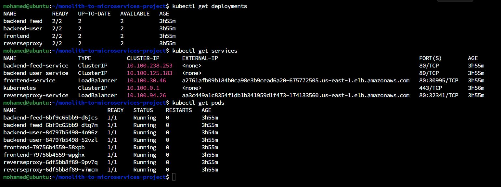

* Project Name: Microservices CI/CD and Deployment on AWS EKS (Elastic Kubernetes Service)
* Version: v1.0.0
* Organization Department: Technology

### Description

In this project, I transformed a web application originally designed with a 
monolithic architecture, which used Angular for the frontend and Node.js 
for the backend, into a microservices-based architecture.

I established a streamlined CI/CD pipeline using Travis CI to automate the 
creation of Docker images for each microservice. These images were then 
seamlessly pushed to Docker Hub, providing a centralized repository for 
easy deployment.

Furthermore, I created a Kubernetes cluster on 
AWS EKS (Elastic Kubernetes Service) and orchestrated the deployment of the 
microservices architecture on the cluster. The application's components were 
divided into four distinct services, each utilizing customized scaling 
rules and autonomous self-healing capabilities.

#### kubectl get deployments
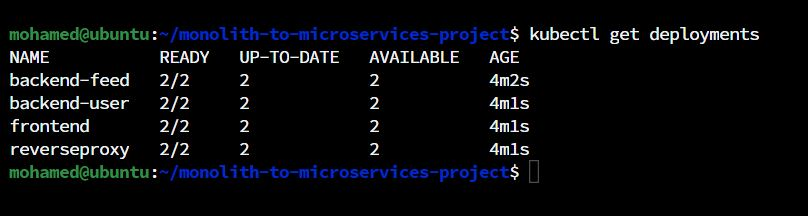

#### kubectl get services
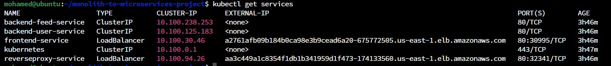

#### kubectl get pods
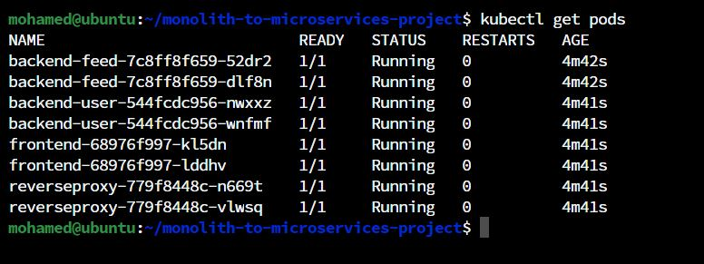

#### kubectl describe services
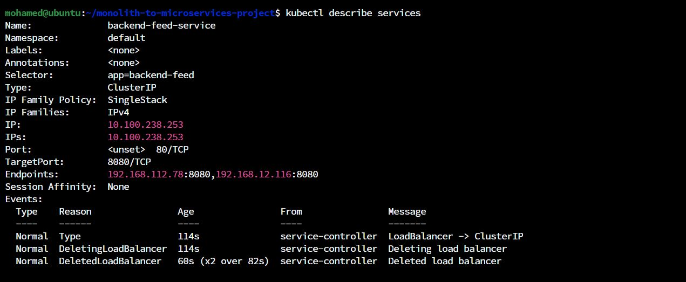
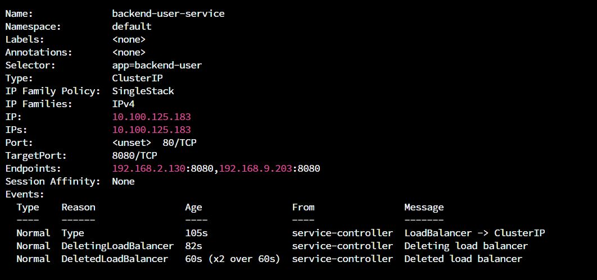
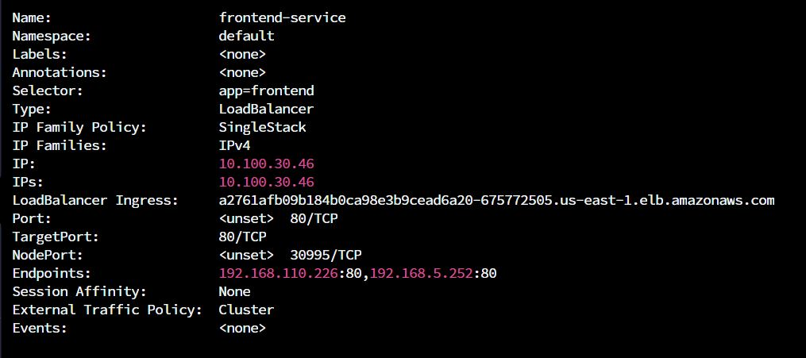
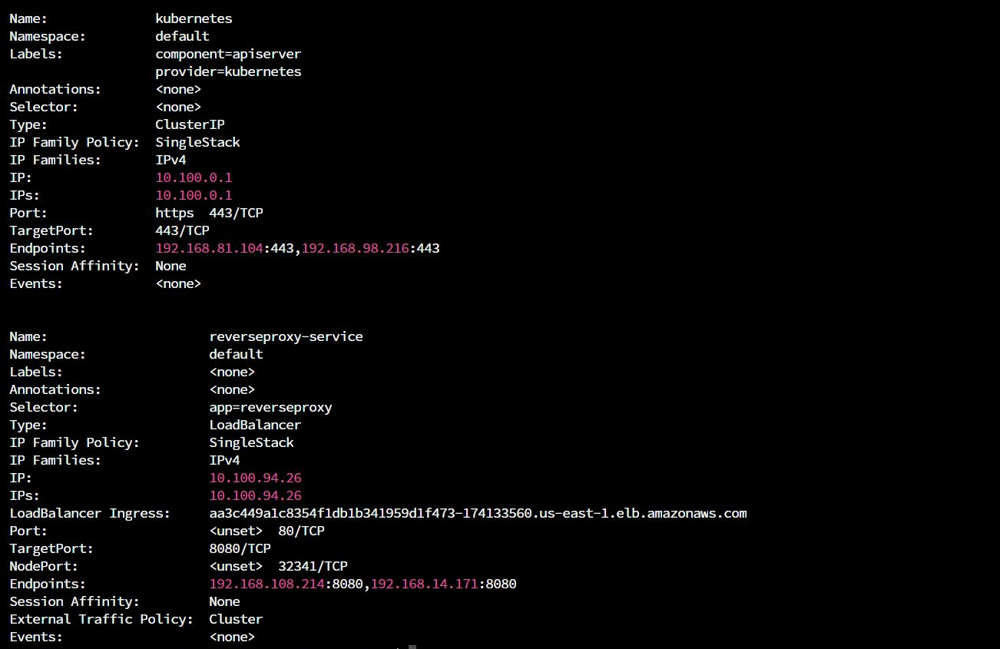

#### kubectl describe hpa
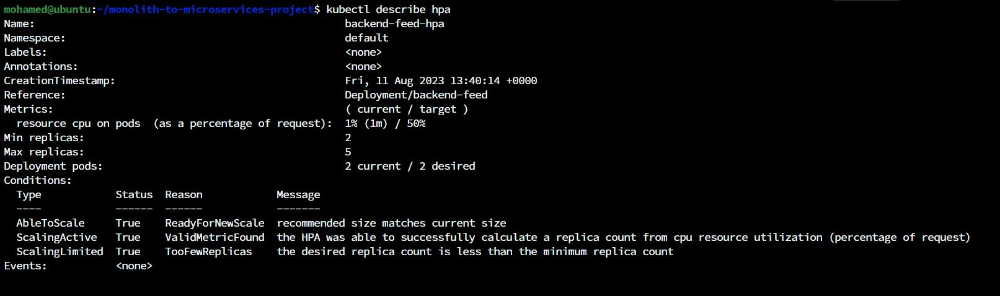
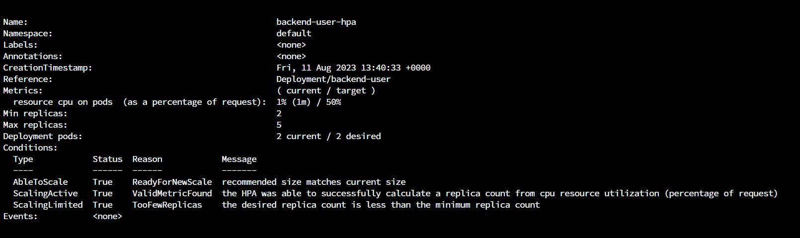
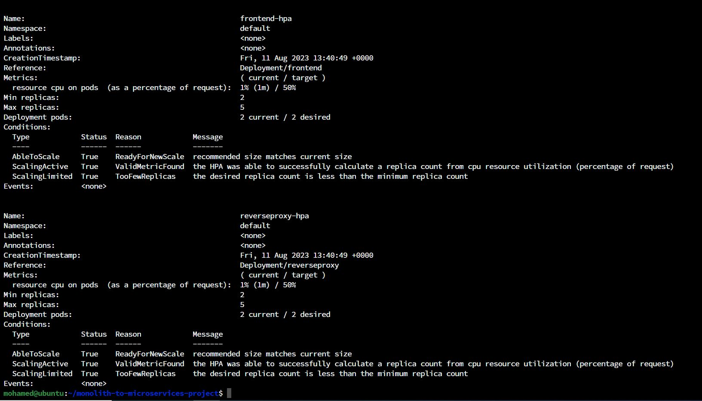

#### Dockerhub Repos
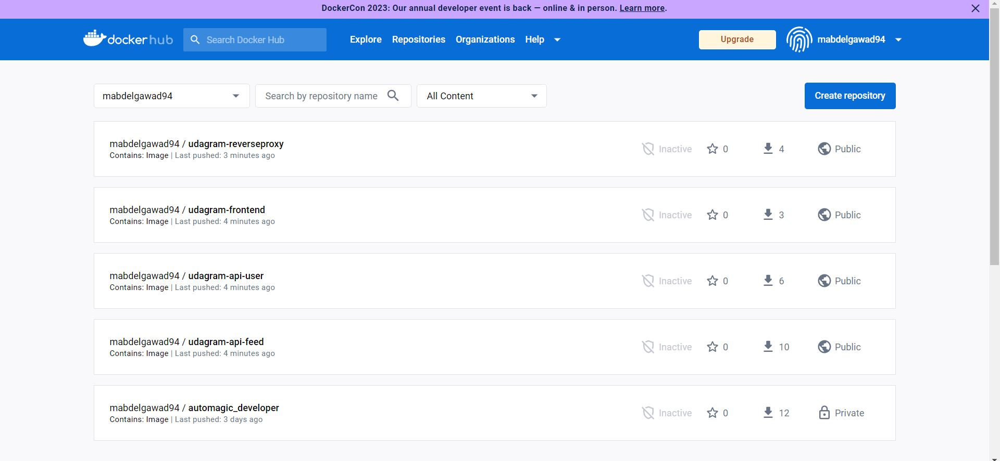

#### Metrics Server Status
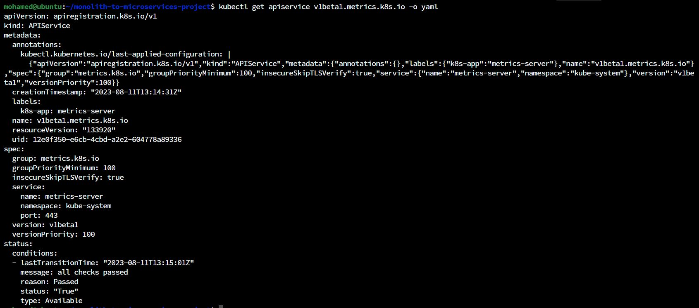

#### Travis CI Job Status
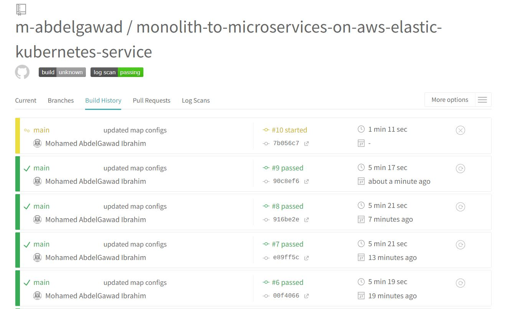
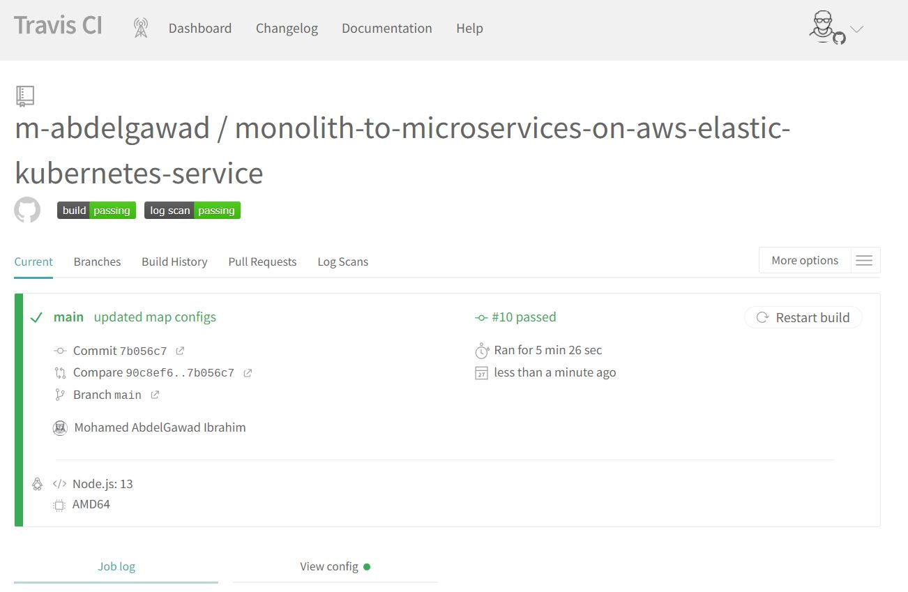

#### kubectl logs -f <pod_name>
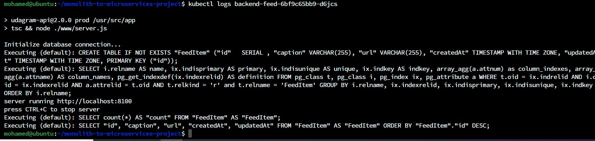

(<a href="#readme-top">back to top</a>)

### Tech Stack

This project was developed using the following tech stack:

* Docker
* Travis CI
* Kubernetes
* AWS EKS (Elastic Kubernetes Service)

(<a href="#readme-top">back to top</a>)

<!-- CONTACT -->
## Contact

Mohamed AbdelGawad Ibrahim - [@m-abdelgawad](https://www.linkedin.com/in/m-abdelgawad/) - <a href="tel:+201069052620">+201069052620</a>

(<a href="#readme-top">back to top</a>)

<!-- MARKDOWN LINKS & IMAGES -->
<!-- https://www.markdownguide.org/basic-syntax/#reference-style-links -->
[linkedin-shield]: https://img.shields.io/badge/-LinkedIn-black.svg?style=for-the-badge&logo=linkedin&colorB=555
[linkedin-url]: https://www.linkedin.com/in/m-abdelgawad/
